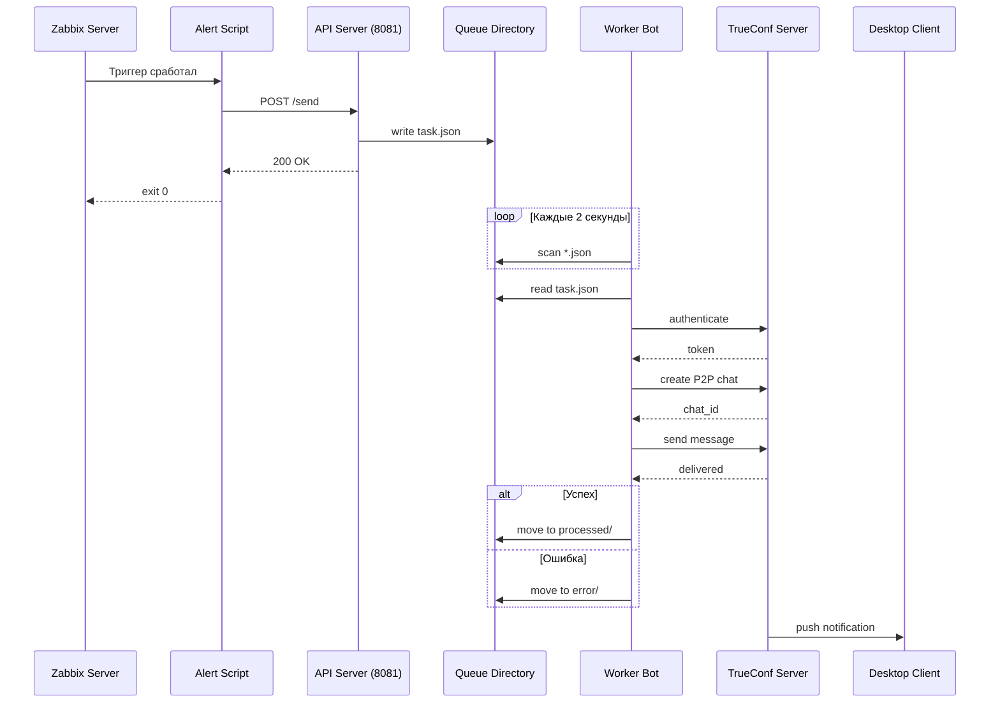

## Описание

   Интеграция для отправки уведомлений из **Zabbix (UDV-ITM)** в **TrueConf** через HTTP API с асинхронной обработкой очереди.

<br/>

## 🚀 Возможности

- ✅ Асинхронная отправка сообщений через очередь
- ✅ Поддержка HTTP API для приема алертов
- ✅ Автоматическое преобразование email → TrueConf ID
- ✅ Персистентная очередь (сообщения не теряются при перезапуске)
- ✅ Полная автономность (не требует интернета после сборки)
- ✅ Docker-образы для production-окружения

<br/>

## 🏗 Архитектура отправки уведомлений



<br/>

## Структура проекта
    .
    ├── docker-compose.yml
    ├── .env.trueconf
    ├── trueconf-sender/
    │   ├── Dockerfile
    │   ├── requirements.txt
    │   └── trueconf_sender.py
    ├── trueconf-data/
    │   ├── api_server.py
    │   └── queue/
    └── env/
        └── alertscripts/
            └── send-trueconf-message.py

<br/>

## 📁 Краткое описание файлов проекта

### 🐳 Docker-конфигурация

| Файл | Описание |
|------|----------|
| `docker-compose.yml` | Основной файл оркестрации, описывает сервисы `trueconf-api` и `trueconf-sender`, их сети, тома и зависимости |
| `trueconf-sender/Dockerfile` | Инструкция сборки Docker-образа для отправителя, устанавливает `libmagic1`, Python-зависимости и копирует `trueconf_sender.py` |
| `trueconf-api/Dockerfile` | Инструкция сборки Docker-образа для API-сервера, устанавливает FastAPI и Uvicorn |

### 🐍 Основные скрипты

| Файл | Описание |
|------|----------|
| `trueconf-sender/trueconf_sender.py` | Основной скрипт-отправитель. Работает в сервисном режиме (`--service`): поддерживает WebSocket-соединение с TrueConf, мониторит очередь и отправляет сообщения |
| `trueconf-data/api_server.py` | HTTP API сервер на FastAPI. Принимает POST-запросы от Zabbix, создает JSON-файлы в очереди, отдает статус по `/health` |
| `env/alertscripts/send-trueconf-message.py` | Скрипт-обертка для Zabbix. Вызывается при срабатывании триггера, отправляет HTTP запрос в `trueconf-api` |

### 📦 Файлы зависимостей

| Файл | Описание |
|------|----------|
| `trueconf-sender/requirements.txt` | Python-зависимости: `httpx`, `python-trueconf-bot`, `tomli` |

### ⚙️ Конфигурационные файлы

| Файл | Описание |
|------|----------|
| `.env.trueconf` | Переменные окружения для TrueConf: хост, порт, логин, пароль, домены для маппинга |
| `trueconf-sender/config.toml` | Конфигурация для `trueconf_sender.py` (генерируется из переменных или монтируется готовый) |

### 📂 Директории данных

| Директория | Описание |
|------------|----------|
| `trueconf-data/queue/` | Персистентная очередь сообщений. API сервер складывает JSON-файлы, Sender их забирает |
| `trueconf-data/processed/` | Обработанные успешно задачи (опционально) |
| `trueconf-data/error/` | Задачи, завершившиеся ошибкой |

### 🔄 Взаимодействие файлов
Zabbix → send-trueconf-message.py → api_server.py → queue/*.json → trueconf_sender.py → TrueConf

<br/>

## Настройка окружения
### Измените файл .env.trueconf:

    TRUECONF_HOST=10.31.193.175
    TRUECONF_PORT=8444
    TRUECONF_VERIFY_SSL=false
    TRUECONF_LOGIN=bot@domain.trueconf.name
    TRUECONF_PASSWORD=your_password
    TRUECONF_FROM_DOMAIN=company.ru
    TRUECONF_TO_DOMAIN=domain.trueconf.name

<br/>

## Настройка типа медиа в Zabbix

    Администрирование → Типы медиа → Создать тип медиа
    Имя: TrueConf
    Тип: Скрипт
    Имя скрипта: send-trueconf-message.py
    Параметры скрипта:
        {ALERT.SENDTO}
        {ALERT.MESSAGE}

<br/>
 
## 🐛 Устранение неполадок

### Проблема: Connection refused

**Решение:** Проверьте доступность TrueConf сервера:

```bash
docker exec trueconf-sender curl -k https://trueconf-test:443
```

<br/>

## Проблема: Missing required config keys

**Решение:** Убедитесь, что переменные окружения переданы:
```bash
docker exec trueconf-sender env | grep TRUECONF
```

<br/>

## 🧪Отправка тестового сообщения через API
### Через curl на хосте
```bash
curl -X POST http://localhost:8081/send \
  -H "Content-Type: application/json" \
  -d '{"sendto": "test2@ru532y.trueconf.name", "message": "Test from console"}
```

### Или из контейнера itmm-server
```bash
docker exec itmm-server curl -X POST http://trueconf-api:8081/send \
  -H "Content-Type: application/json" \
  -d '{"sendto": "test2@ru532y.trueconf.name", "message": "Test from container"}'
```

### Через Python (более детально)
```python
docker exec itmm-server python3 -c "
import urllib.request
import json

url = 'http://trueconf-api:8081/send'
data = json.dumps({
    'sendto': 'test2@ru532y.trueconf.name',
    'message': 'Hello from Python console!'
}).encode()

req = urllib.request.Request(url, data=data, headers={'Content-Type': 'application/json'}, method='POST')
try:
    with urllib.request.urlopen(req, timeout=10) as resp:
        print('Response:', resp.read().decode())
except Exception as e:
    print('Error:', e)
"
```

<br/>

## 📂Просмотр очереди
### Посмотреть файлы в очереди
```bash
ls -la /opt/mntr/trueconf-data/queue/
```

### Посмотреть содержимое последнего файла
```bash
cat /opt/mntr/trueconf-data/queue/*.json | tail -20
```

<br/>

## 📊Мониторинг логов в реальном времени
### В одном окне смотрим логи sender
```bash
docker logs -f trueconf-sender
```

### В другом окне отправляем сообщения
```bash
curl -X POST http://localhost:8081/send \
  -H "Content-Type: application/json" \
  -d '{"sendto": "test2@ru532y.trueconf.name", "message": "Test"}'
```

<br/>

## 📈Проверка статуса очереди
### Получить информацию о очереди через API
```bash
curl -s http://localhost:8081/health | python3 -m json.tool
```

